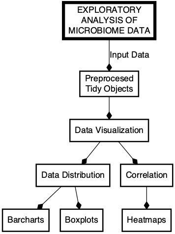

...IN PROGRESS...

# Microbiome Machine Learning

 

<!-- -->

<a href="">Workflow for bioinformatics analysis of microbiome data.</a>

 

The <strong>iMAP-PART4</strong> is one of the practical user guides for providing analytical support to the microbiome research community. Explore more guides from the table below:

## Related resources

|Repo| Description| Repo Output|
|-------------------------|---------------------------------------------------|-----------------|
|[iMAP-PART1](https://github.com/tmbuza/iMAP-part1/) | How to Get Started with Microbiome Data Analysis | [eBook](https://complexdatainsights.com/books/microbiome-analysis/getting-started) |
|[iMAP-PART2](https://github.com/tmbuza/iMAP-part2/) | Bioinformatics Analysis of Microbiome Data | [eBook](https://complexdatainsights.com/books/microbiome-analysis/bioinformatics-analysis) |
|[iMAP-PART3](https://github.com/tmbuza/iMAP-part3/) | Exploratory Analysis of Microbiome Data | [eBook](https://complexdatainsights.com/books/microbiome-analysis/exploratory-analysis) |

## Citation
> Please consider citing the [iMAP article](https://rdcu.be/b5iVj) if you find any part of the iMAP practical user guides helpful in your analysis:

Teresia M. Buza, Triza Tonui, Francesca Stomeo, Christian Tiambo, Robab Katani, Megan Schilling, Beatus Lyimo, Paul Gwakisa, Isabella M. Cattadori, Joram Buza and Vivek Kapur. iMAP: an integrated bioinformatics and visualization pipeline for microbiome data analysis. BMC Bioinformatics (2019) 20:374. [Free Full Text](https://pubmed.ncbi.nlm.nih.gov/31269897/).

